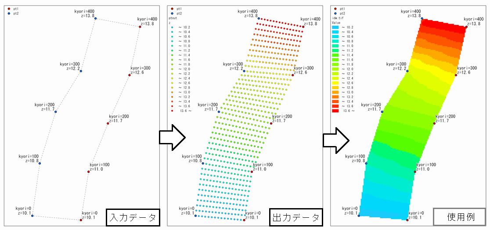

# interpoint

ポイントデータに格納した値を平面上で線形補間します。

# 入出力イメージ



使用例には、出力ポイントデータをIDW内挿して作成したラスタを載せています。

# 入力ポイントデータについて

対象範囲の両端（河川の左岸側と右岸側など）をシェープファイル形式で指定します。

テーブルには縦断距離と値（標高値など）を格納してください。

両データの投影座標系、ポイント数、縦断距離は一致させてください。

値（標高値など）を一致させる必要はありません。


# 既知点間の分割について

縦断方向の分割間隔は、入力データに格納している縦断距離を基準に指定します。

横断方向は、分割数で指定します。


# 出力について

以下の値を格納した3Dポイントデータをシェープファイル形式で出力します。

|  フィールド名  |  説明  |
| ---- | ---- |
|  i  |  横断方向の連番  |
|  m  |  縦断距離  |
|  z  |  値（標高値など）  |


# 入力例

```
1つめの入力ファイルを指定
>> c:\test\pt1.shp

0 kyori int64
1 z float64

縦断距離を格納したフィールドの番号を指定
>> 0
標高値を格納したフィールドの番号を指定
>> 1 

2つめの入力ファイルを指定
>> c:\test\pt2.shp

0 kyori int64
1 z float64

縦断距離を格納したフィールドの番号を指定
>> 0
標高値を格納したフィールドの番号を指定
>> 1 

縦断方向の分割間隔を指定
>> 20
横断方向の分割数を指定
>> 15
出力フォルダを指定
>> C:\test
出力ファイル名を指定（拡張子不要）
>> ptout
```


# ライブラリ

python  3.9.5  
geopandas  0.10.2  
numpy  1.21.1  
pandas  1.3.1  
scipy  1.7.0


# License

Copyright (c) 2022 sbt80171

Released under the [MIT license](https://opensource.org/licenses/mit-license.php).
